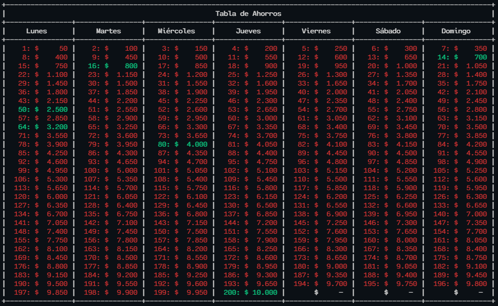
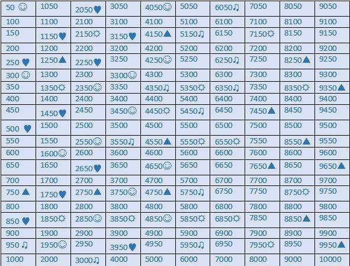

# Ahorros
Aplicación CLI Aplicación CLI para gestionar la técnica de ahorro *1 millón en 6 meses*



basado en:


Para este proyecto se empleo **Python 3.9.2**

Para ejecutar este archivo se necesita activar el entorno virtual y ejecutar:
```
python main.py
```
